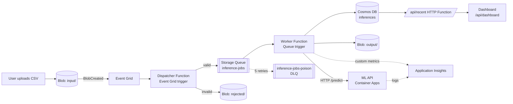

# Event-Driven Machine Learning Pipeline on Azure

An end-to-end, event-driven, serverless ML inference pipeline on Microsoft Azure,
built within the Azure for Students credit limit. A CSV uploaded to Blob Storage
is automatically validated, queued, scored by a containerised ML API, persisted
to Cosmos DB, and surfaced on a live dashboard with full observability and CI/CD.

> ECE Paris MSc 2 AI *Distributed Systems and AI* integrative project.

---

## 1. Architecture



**Flow:** upload → Event Grid `BlobCreated` event → dispatcher validates
(extension, size, CSV schema) → publishes a job to a Storage Queue → worker
consumes it, calls the ML API, and writes results to `output/` + Cosmos DB → the
dashboard reads the latest inferences through an HTTP Function. Failed messages
retry up to 5 times then land in a poison (dead-letter) queue. Custom metrics flow
to Application Insights.

---

## 2. Dataset, ML task, and metrics

- **Dataset:** UCI Wine Quality (red), ~1,599 rows, 11 numeric physicochemical
  features. Open source, < 100 MB.
- **Task:** binary classification — *good wine* = `quality >= 7`. Binary lets the
  model return a natural confidence score via `predict_proba`.
- **Model:** `RandomForestClassifier` (`class_weight="balanced"` — the dataset is
  imbalanced, ~13.6% positive), exported as `model_v1.0.0.pkl`.
- **Reproducibility:** fixed seed (42), pinned `requirements.txt`, dataset SHA-256
  recorded in the model bundle.

| Metric | Value |
|---|---|
| Accuracy | 0.925 |
| F1 | 0.70 |
| Precision | 0.757 |
| Recall | 0.651 |
| ROC-AUC | 0.937 |
| Positive rate | 13.6% |
| Train / test split | 1279 / 320 |

---

## 3. Repository structure

```
api/         FastAPI inference service, multi-stage Dockerfile, pytest tests
functions/   Azure Functions (dispatcher, worker, recent, dashboard) + dashboard.html
model/        training script, dataset, exported model, schema.json, metrics.json
web/          dashboard page (canonical copy)
tests/        end-to-end integration notes
docs/         architecture diagram, KQL screenshots
.github/workflows/   ci.yml (lint/test/build) and deploy.yml (CD)
```

---

## 4. Inference API

FastAPI, deployed on Azure Container Apps (0.25 vCPU / 0.5 GiB, autoscale 0–3).

| Endpoint | Method | Purpose |
|---|---|---|
| `/health` | GET | OK/KO + model load time (liveness) |
| `/version` | GET | model + API versions |
| `/predict` | POST | prediction + confidence (Pydantic-validated input) |
| `/metrics` | GET | call count, error rate, average latency |

**Example call:**
```bash
curl -X POST "https://<app-fqdn>/predict" \
  -H "Content-Type: application/json" \
  -d '{"fixed_acidity":7.4,"volatile_acidity":0.35,"citric_acid":0.4,
       "residual_sugar":2.0,"chlorides":0.07,"free_sulfur_dioxide":15.0,
       "total_sulfur_dioxide":40.0,"density":0.9968,"pH":3.3,
       "sulphates":0.7,"alcohol":12.5}'
```
```json
{"prediction":1,"label":"good","confidence":0.5537,"model_version":"1.0.0","duration_ms":24.98}
```

---

## 5. Event-driven pipeline

**Example Event Grid event** (`Microsoft.Storage.BlobCreated`, what the dispatcher receives):
```json
{
  "topic": "/subscriptions/.../storageAccounts/stmlpipefb2026",
  "subject": "/blobServices/default/containers/input/blobs/test_wines.csv",
  "eventType": "Microsoft.Storage.BlobCreated",
  "data": { "api": "PutBlob", "contentType": "text/csv", "url": "https://.../input/test_wines.csv" },
  "eventTime": "2026-06-01T19:45:00Z"
}
```

**Example Storage Queue message** (what the dispatcher publishes, the worker consumes):
```json
{
  "blob_name": "test_wines.csv",
  "container": "input",
  "size": 312,
  "received_at": "2026-06-01T19:45:02.118Z"
}
```

**Resilience:** the worker is idempotent (deterministic Cosmos document id
`<blob>-<row>` + upsert). Queue retries are capped at 5 (`host.json`
`maxDequeueCount`); exhausted messages move to `inference-jobs-poison` (DLQ).

---

## 6. Observability

Application Insights collects logs and three custom metrics emitted by the worker
via the Azure Monitor OpenTelemetry metric exporter:
`inference_count`, `model_latency_ms`, `api_error_count`.
Ingestion is capped at 1 GB/day to stay within the free 5 GB/month.

**Alerts:** (a) error rate > 5% over 5 min; (b) p95 latency > 2 s.

**KQL queries** (run in the App Insights *Logs* blade; screenshots in `docs/`):

Inferences per hour:
```kql
customMetrics
| where name == "inference_count"
| summarize inferences = sum(value) by bin(timestamp, 1h)
| order by timestamp asc
```
Top 5 slowest worker runs:
```kql
requests
| where name == "worker"
| top 5 by duration desc
| project timestamp, duration_ms = duration, success
```
Distribution of result codes:
```kql
requests
| summarize count() by resultCode
| order by count_ desc
```

---

## 7. CI/CD (GitHub Actions)

- **`ci.yml`** (push / PR): ruff lint, pytest, and a Docker build validation.
  Runs with no Azure credentials.
- **`deploy.yml`** (push to `main`): build & push image to ACR → deploy to
  **staging** → **prod** behind a manual-approval environment → smoke tests.

---

## 8. Reproducible deployment

```bash
# Variables (region must be in the subscription's allowed list)
export RG="rg-mlpipe-dev" LOCATION="germanywestcentral"
export ACR_NAME="acrwinefb2026" ENV="cae-mlpipe" STORAGE="stmlpipefb2026"
export COSMOS="cosmosmlpipefb2026" FUNCAPP="func-mlpipe-fb2026"

az group create -n $RG -l $LOCATION

# ML API: registry, image (built locally for linux/amd64), Container Apps
az acr create -g $RG -n $ACR_NAME --sku Basic
docker build --platform linux/amd64 -t $ACR_NAME.azurecr.io/wine-api:1.0.0 ./api
az acr login -n $ACR_NAME && docker push $ACR_NAME.azurecr.io/wine-api:1.0.0
az containerapp env create -n $ENV -g $RG -l $LOCATION
az containerapp create -n wine-api -g $RG --environment $ENV \
  --image $ACR_NAME.azurecr.io/wine-api:1.0.0 \
  --registry-server $ACR_NAME.azurecr.io --registry-identity system \
  --target-port 8000 --ingress external --cpu 0.25 --memory 0.5Gi \
  --min-replicas 0 --max-replicas 3

# Storage: containers + queue
az storage account create -n $STORAGE -g $RG -l $LOCATION --sku Standard_LRS
az storage container create -n input  --account-name $STORAGE
az storage container create -n output --account-name $STORAGE
az storage container create -n rejected --account-name $STORAGE
az storage queue create -n inference-jobs --account-name $STORAGE

# Cosmos DB (Free Tier)
az cosmosdb create -n $COSMOS -g $RG --locations regionName=$LOCATION --enable-free-tier true
az cosmosdb sql database create --account-name $COSMOS -g $RG -n mlpipe
az cosmosdb sql container create --account-name $COSMOS -g $RG --database-name mlpipe \
  -n inferences --partition-key-path "/file_name" --throughput 400

# Functions (config + deploy)
az functionapp create -n $FUNCAPP -g $RG --storage-account $STORAGE \
  --consumption-plan-location $LOCATION --runtime python --runtime-version 3.11 \
  --functions-version 4 --os-type Linux
az functionapp config appsettings set -n $FUNCAPP -g $RG --settings \
  API_URL="https://<app-fqdn>" COSMOS_CONNECTION="<conn>" COSMOS_DB="mlpipe" \
  COSMOS_CONTAINER="inferences"
cd functions && func azure functionapp publish $FUNCAPP --build remote --python && cd ..

# Event Grid subscription (input/ -> dispatcher)
az eventgrid event-subscription create --name input-blobcreated \
  --source-resource-id $(az storage account show -n $STORAGE -g $RG --query id -o tsv) \
  --endpoint-type azurefunction \
  --endpoint ".../sites/$FUNCAPP/functions/dispatcher" \
  --included-event-types Microsoft.Storage.BlobCreated \
  --subject-begins-with "/blobServices/default/containers/input/"

# Cleanup at end of session
az group delete -n $RG --yes --no-wait
```

---

## 9. Cost estimate (Azure for Students, $100 credit)

| Service | Tier | Est. monthly cost |
|---|---|---|
| Container Apps | Consumption, min-replicas 0 | ~$0 idle |
| Azure Functions | Consumption (1M free exec) | ~$0 |
| Cosmos DB | Free Tier (1000 RU/s, 25 GB) | $0 |
| Storage + Queue | Standard_LRS, minimal data | < $1 |
| Application Insights | 1 GB/day cap (5 GB/mo free) | ~$0 |
| Event Grid | 100k free ops/mo | $0 |
| ACR | Basic | ~$5 (~$0.17/day) |

Dominant cost is ACR Basic; the compute tiers cost ~nothing when idle thanks to
scale-to-zero. A budget alert is configured at 50% and 80%.

---

## 10. Platform constraints encountered (Azure for Students)

The subscription's policies forced several defensible design decisions:

- **Region policy:** deployments restricted to 5 regions; `germanywestcentral`
  chosen from the allowed list (others like `francecentral` were blocked).
- **ACR Tasks disabled:** `az acr build` is not permitted, so the image is built
  locally for `linux/amd64` and pushed (the same step CI automates).
- **Service principals blocked:** the tenant forbids app registration, so the CD
  workflow is authored and correct but cannot run live (no `AZURE_CREDENTIALS`).
  CI runs fully.
- **Static Web Apps regions** don't overlap the allowed list, so the dashboard is
  served from the Function App (`/api/dashboard`) instead — same learning outcome,
  no extra resource, no CORS.
